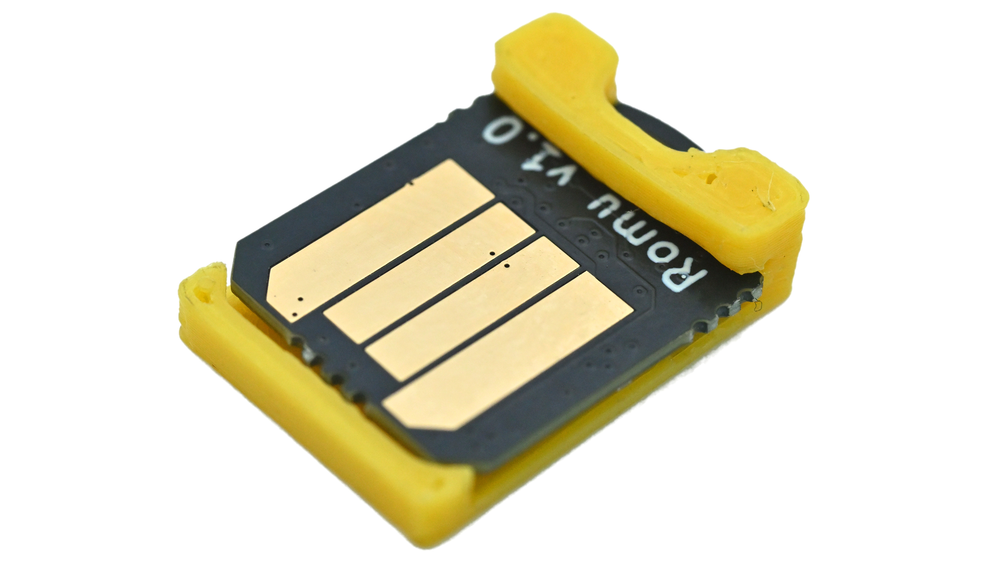

# Romu

<figure><figcaption></figcaption></figure>

## PRODUCT OVERVIEW

Romu is a compact USB Type-A development board powered by the Raspberry Pi RP2354A microcontroller. Designed to be carried on a keychain, Romu plugs directly into any USB Type-A port, eliminating the need for cables while providing an easy platform for USB application development and embedded experimentation.

It ships with MicroPython preloaded, allowing users to start developing immediately without additional programmers or drivers. For advanced users, the optional Programming & Debugging Jig provides access to USB, SWD, and UART interfaces.

## KEY FEATURES

<table data-header-hidden><thead><tr><th valign="top"></th><th valign="top"></th></tr></thead><tbody><tr><td valign="top">
<strong>✔  Native MicroPython Support</strong>

Preloaded and ready to code in Thonny IDE, no drivers or external programmer needed.
</td><td valign="top">
<strong>✔  Direct USB Type-A Interface</strong>

Plugs straight into any USB port, no cables, breadboards, or adapters required.
</td></tr><tr><td valign="top">
<strong>✔  Dual-Core RP2354A MCU</strong>

Arm Cortex-M33 or Hazard3 RISC-V @ 150MHz, with 520 KB SRAM and 2 MB flash.
</td><td valign="top">
<strong>✔  RGB LED &#x26; Capacitive Touch</strong>

Onboard RGB LED and a capacitive touch button for status feedback and input.
</td></tr><tr><td valign="top">
<strong>✔  Full Debug Access via Jig</strong>

Optional pogo-pin Programming &#x26; Debugging Jig exposes USB, SWD, and UART.
</td><td valign="top">
<strong>✔  Open Source Hardware</strong>

Complete schematics, PCB files, BOM, and example MicroPython projects.
</td></tr></tbody></table>

## TECHNICAL SPECIFICATIONS

<table data-header-hidden><thead><tr><th valign="top"></th><th valign="top"></th></tr></thead><tbody><tr><td valign="top"><h4><strong>Parameter</strong></h4></td><td valign="top"><h4>Specifications</h4></td></tr><tr><td valign="top">MCU</td><td valign="top">Raspberry Pi RP2354A - dual Arm Cortex-M33 or dual Hazard3 RISC-V @ 150MHz</td></tr><tr><td valign="top">SRAM</td><td valign="top">520 KB</td></tr><tr><td valign="top">Flash</td><td valign="top">2 MB embedded</td></tr><tr><td valign="top">USB Interface</td><td valign="top">Native USB 2.0 Full-Speed (USB Type-A)</td></tr><tr><td valign="top">Power Supply</td><td valign="top">5V from USB, regulated to 3.3V onboard</td></tr><tr><td valign="top">Indicators</td><td valign="top">1x RGB LED</td></tr><tr><td valign="top">Input</td><td valign="top">Capacitive touch button</td></tr><tr><td valign="top">Controls</td><td valign="top">Boot button (firmware flashing)</td></tr><tr><td valign="top">Programming</td><td valign="top">USB DFU, SWD test points</td></tr><tr><td valign="top">Debugging</td><td valign="top">UART TX/RX test points</td></tr><tr><td valign="top">PCB Dimensions</td><td valign="top">15.5 x 12 x 1.65 mm</td></tr><tr><td valign="top">Connector</td><td valign="top">Direct USB Type-A interface</td></tr><tr><td valign="top">Enclosure</td><td valign="top">Pre-installed 3D-printed protective shim</td></tr><tr><td valign="top">Software</td><td valign="top">MicroPython (preloaded), Thonny IDE compatible</td></tr><tr><td valign="top">Weight</td><td valign="top">1 grams</td></tr><tr><td valign="top">Operating Temperature</td><td valign="top">0 to 70 °C</td></tr></tbody></table>

**Programming & Debugging Jig (Optional Accessory)**

<table data-header-hidden><thead><tr><th valign="top"></th><th valign="top"></th></tr></thead><tbody><tr><td valign="top"><h4><strong>Parameter</strong></h4></td><td valign="top"><h4>Specifications</h4></td></tr><tr><td valign="top">Connectivity</td><td valign="top">USB Type-C</td></tr><tr><td valign="top">Debug Interface</td><td valign="top">SWD via standard 20-pin JTAG connector</td></tr><tr><td valign="top">UART</td><td valign="top">RX/TX breakout</td></tr><tr><td valign="top">Board Insertion</td><td valign="top">Tool-free, precision pogo-pin fixture</td></tr></tbody></table>
